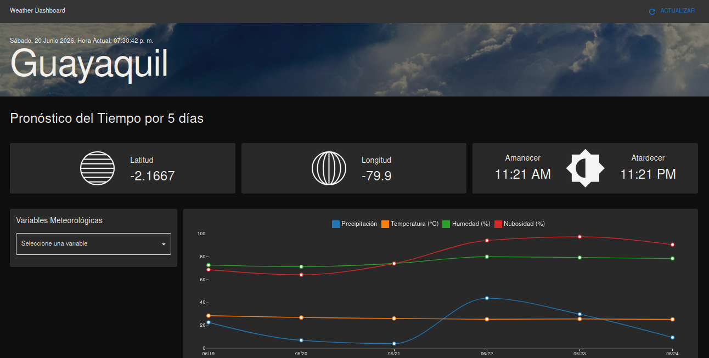

<h1 align="center">print("Hello, World!")</h1>
<h3 align="center">I'm Genesis, a Computer Science student at ESPOL</h3>
<!--Nakanoart Nakanodrawing GIF-->

  

## About Me
* ❤️ Interested in cybersecurity and AI
* 🌱 Currently learning React
* 📫 How to reach me: gennalop@espol.edu.ec

## Languages and Tools

 
    
     
    
    
    
    
    
     

## Proyects

<table>
  <tr>
    <td align="center"><a href="https://app.somoskolibri.com/features/auth/auth"><b>Web Form Life Coaching</b></a></td>
    <td align="center"><a href="https://gennalop.github.io/Landing/"><b>Course Landing Page</b></a></td>
    <td align="center"><a href="https://gennalop.github.io/dashboard/"><b>Weather Dashboard</b></a></td>
  </tr>
  <tr>
    <td align="center" valign="top" width="33%">Progressive web app for personal growth tracking, featuring introspective forms and automated PDF report generation.</td>
    <td align="center" valign="top" width="33%">A landing page promoting technical and artisanal training courses for a non-profit foundation.</td>
    <td align="center" valign="top" width="33%">Responsive weather dashboard consuming OpenWeatherMap REST API, with JSON data handling and real-time display.</td>
  </tr>
  <tr>
    <td align="center" valign="middle">
      
      
      
      
    </td>
    <td align="center" valign="middle">
      
      
      
      
      
    </td>
    <td align="center" valign="middle">
      
      
      
    </td>
  </tr>
  <tr>
    <td align="center"></td>
    <td align="center"></td>
    <td align="center"></td>
  </tr>
  <tr>
    <td></td>
    <td></td>
    <td></td>
  </tr>
</table>
  
## My Github Stats
<!-- Github stats from https://github.com/anuraghazra/github-readme-stats-->

